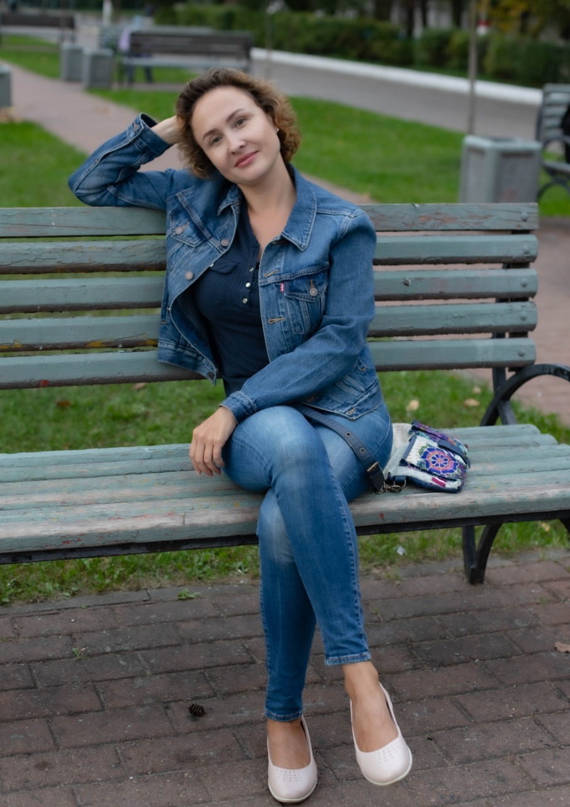

# Немного обо мне

Меня зовут Бархатова Елена

Я учусь в Нетологии на курсе **Веб-разработчик с нуля**.

## Я прошла следующие модули:
- HTML-верстка: с нуля до первого макета
- Адаптивная и мобильная верстка
- Основы программирования
  
  